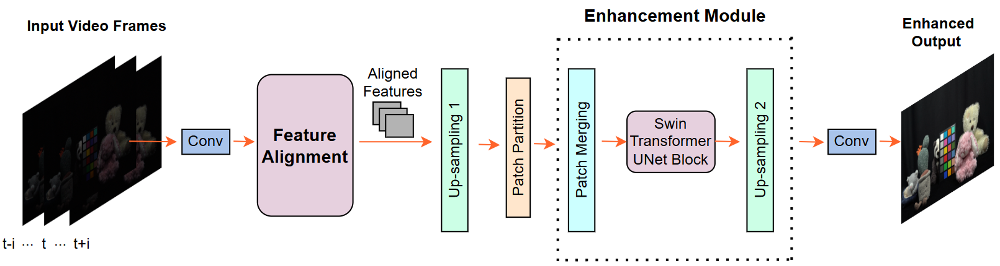

# A SPATIO-TEMPORAL ALIGNED SUNET MODEL FOR LOW-LIGHT VIDEO ENHANCEMENT  

<!-- ## author   -->

***
> Abstract : Distortions caused by low-light conditions are not only visually unpleasant but also degrade the performance of computer vision tasks. The restoration and enhancement have proven to be highly beneficial. However, there are only a limited number of enhancement methods explicitly designed for videos acquired in low-light conditions. We propose a Spatio-Temporal Aligned SUNet (STA-SUNet) model using a Swin Transformer as a backbone to capture low light video features and exploit their spatio-temporal correlations. The STA-SUNet model is trained on a novel, fully registered dataset (BVI), which comprises dynamic scenes captured under varying light conditions. It is further analysed comparatively against various other models over three test datasets. The model demonstrates superior adaptivity across all datasets, obtaining the highest PSNR and SSIM values. It is particularly effective in extreme low-light conditions, yielding fairly good visualisation results.


## STA-SUNet Architecture  


## TODO
## Train
```
python train.py
```
