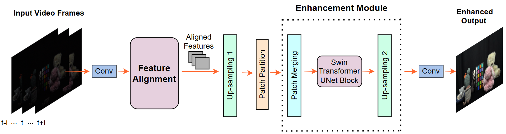
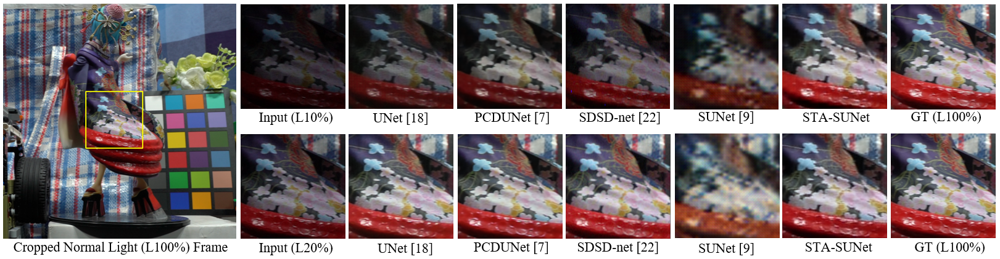

# A SPATIO-TEMPORAL ALIGNED SUNET MODEL FOR LOW-LIGHT VIDEO ENHANCEMENT  [[Paper]](10.1109/ICIP51287.2024.10647380)

<h4 align="center">Ruirui Lin, Nantheera Anantrasirichai, Alexandra Malyugina, David Bull</center>
<h4 align="center">Visual Information Laboratory, University of Bristol, UK</center>

***
> Abstract : Distortions caused by low-light conditions are not only visually unpleasant but also degrade the performance of computer vision tasks. The restoration and enhancement have proven to be highly beneficial. However, there are only a limited number of enhancement methods explicitly designed for videos acquired in low-light conditions. We propose a Spatio-Temporal Aligned SUNet (STA-SUNet) model using a Swin Transformer as a backbone to capture low light video features and exploit their spatio-temporal correlations. The STA-SUNet model is trained on a novel, fully registered dataset (BVI), which comprises dynamic scenes captured under varying light conditions. It is further analysed comparatively against various other models over three test datasets. The model demonstrates superior adaptivity across all datasets, obtaining the highest PSNR and SSIM values. It is particularly effective in extreme low-light conditions, yielding fairly good visualisation results.

***
## STA-SUNet Architecture


## Visual Comparison



## Dataset Preparation

### 1. Download the dataset

Download the video dataset from [BVI-RLV: Fully Registered Low-Light Videos](https://dx.doi.org/10.21227/mzny-8c77).

Data Structure
```
.
└── BVI-RLV dataset
    ├── input
    │   ├── S01
    │   │   ├── low_light_10
    │   │   └── low_light_20
    │   ├── S02
    │   │   ├── low_light_10
    │   │   └── low_light_20
    │   └── ...
    └── gt
        ├── S01
        │   ├── normal_light_10
        │   └── normal_light_20
        ├── S02
        │   ├── normal_light_10
        │   └── normal_light_20
        └── ...
```

### 2. Modify the dataset path

Modify the dataset path in the config file `STASUNet.yml`. 

### Train and test on other dataset  
Please modify `data_loader.py`  to train and test on other datasets.

## Train
```
python train.py
```

## Test
```
python test.py
```

## Citation
If you use our code in your research and find this useful, please consider citing:
```
@INPROCEEDINGS{10647380,
  author={Lin, Ruirui and Anantrasirichai, Nantheera and Malyugina, Alexandra and Bull, David},
  booktitle={2024 IEEE International Conference on Image Processing (ICIP)}, 
  title={A Spatio-Temporal Aligned SUNet Model For Low-Light Video Enhancement}, 
  year={2024},
  volume={},
  number={},
  pages={1480-1486},
  keywords={Adaptation models;Visualization;Computer vision;Correlation;Computational modeling;Transformers;Distortion;Low-light;Video enhancement;Swin transformer;Restoration},
  doi={10.1109/ICIP51287.2024.10647380}}
```

### License and Acknowledgement
This project is released under the [Apache 2.0 license](LICENSE). The code is based on [EDVR](https://github.com/xinntao/EDVR) and [SUNet](https://github.com/FanChiMao/SUNet). Many thanks to the authors for their excellent work.